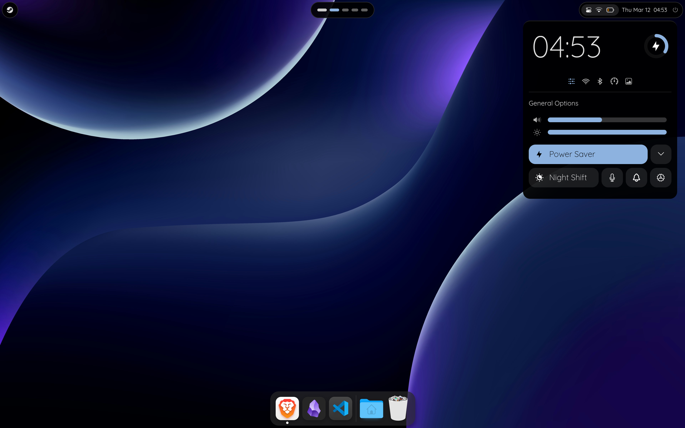

# Kiwi Shell

A clean, macOS-inspired desktop shell for **Hyprland** — featuring a status bar, app switcher, application dock, and quick settings panel.



More screenshots [here](./docs/screenshots/screenshots.md).

---

## Why Kiwi Shell?
- Kiwi Shell focuses on a polished, professional aesthetic inspired by macOS.
- Kiwi Shell is easy to install — one command on Arch, a few lines in your flake on NixOS.
- Kiwi Shell is designed to be configurable. It comes with it's own [settings](https://github.com/selimbucher/kiwi-settings) app and supports config files.
- Kiwi Shell is lightweight by design. Built on [Astal](https://github.com/aylur/astal), it reacts to system changes instead of polling for them, keeping CPU usage low and the interface snappy.

If you run into any problems, I am happy to help. Just open an issue on github.

---

## Requirements

Make sure the following services are installed and running on your system:

| Service | Purpose |
|---|---|
| NetworkManager | Wi-Fi & network management |
| BlueZ | Bluetooth |
| Power Profiles Daemon | Power mode switching |
| WirePlumber | Audio control |
| UPower | Battery info *(optional, recommended for laptops)* |

---

## Installation

### Arch Linux

**1.** Install the required system services:

```bash
sudo pacman -S networkmanager bluez power-profiles-daemon wireplumber upower
```

**2.** Install Kiwi Shell from the AUR:

```bash
yay -S kiwi-shell
```

### NixOS & Home Manager

**1.** Add Kiwi Shell to your `flake.nix` inputs:

```nix
{
  inputs = {
    kiwi-shell.url = "github:selimbucher/hyprland-widgets";
    kiwi-shell.inputs.nixpkgs.follows = "nixpkgs";
  };
}
```

**2.** Add the package in your Home Manager config (usually `home.nix`):

```nix
{ inputs, pkgs, ... }:
{
  home.packages = [
    inputs.kiwi-shell.packages.${pkgs.system}.default
  ];
}
```

---

## Usage

Start Kiwi Shell by running:

```bash
kiwi
```

To launch it automatically on login, add this to your Hyprland config:

```ini
exec-once = kiwi
```

### Theme Color

When you change the accent color in the app, a config file is written to `~/.config/kiwi-shell/hypr.conf`:

```conf
$kiwiColorLight = rgba(179,165,231,0.7)
```

You can include this in your Hyprland config to match your window border color:

```ini
source = ~/.config/kiwi-shell/hypr.conf
```

### App Switcher (Alt+Tab)

The app switcher is controlled via `kiwictl`. Bind these commands in your Hyprland config:

| Command | Description |
|---|---|
| `kiwictl apps open-next` | Cycle to the next open app |
| `kiwictl apps confirm` | Switch to the selected app |
| `kiwictl apps close` | Dismiss the switcher |

Setting up the keybinds can be a little tricky — see the [App Switcher Guide](./docs/AppSwitcherKeybinds.md) for a step-by-step walkthrough.

---

## Icon Theme & Font

To match the look in the screenshots, install the following:

- **Font:** [Quicksand](https://aur.archlinux.org/packages/ttf-quicksand-variable) (`ttf-quicksand-variable` on AUR)
- **Icons:** [WhiteSur Icon Theme](https://github.com/vinceliuice/WhiteSur-icon-theme) with *Alternative Icons* and *Bold Panel Icons* enabled

---

## License

GPL-3.0-or-later. See [LICENSE](./LICENSE) for details.
