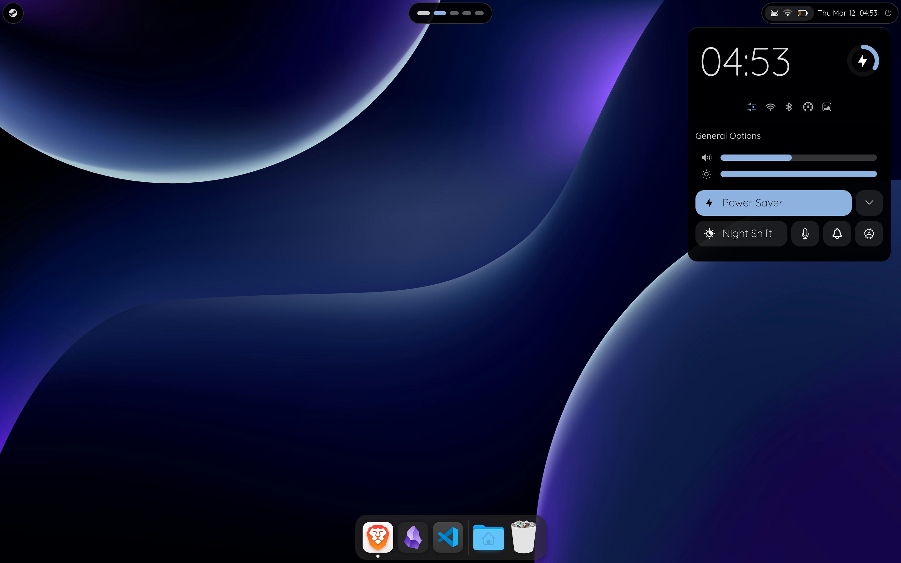

# Kiwi Shell

A macOS-inspired desktop shell for **Hyprland**: status bar, dock, app
switcher, workspace switcher, app launcher, notification center, desktop
icons and a quick settings panel.



More screenshots [here](./docs/screenshots/screenshots.md).

Built on [Astal](https://github.com/aylur/astal), so it reacts to compositor
and system events instead of polling. Configured through config files or the
[kiwi-settings](https://github.com/selimbucher/kiwi-settings) app.

If you run into any problems, open an issue on GitHub.

---

## Requirements

**Hyprland** — lua configs (0.56+) and classic `hyprland.conf` configs both work.

Make sure the following services are installed and running on your system:

| Service | Purpose |
|---|---|
| NetworkManager | Wi-Fi & network management |
| BlueZ | Bluetooth |
| Power Profiles Daemon | Power mode switching |
| WirePlumber | Audio control |
| UPower | Battery info *(optional, recommended for laptops)* |

---

## Installation

### Arch Linux

**1.** Install the required system services:

```bash
sudo pacman -S networkmanager bluez power-profiles-daemon wireplumber upower
```

**2.** Install Kiwi Shell from the AUR:

```bash
yay -S kiwi-shell
```

### NixOS & Home Manager

**1.** Add Kiwi Shell to your `flake.nix` inputs:

```nix
{
  inputs = {
    kiwi-shell.url = "github:selimbucher/hyprland-widgets";
    kiwi-shell.inputs.nixpkgs.follows = "nixpkgs";
  };
}
```

**2.** Add the package in your Home Manager config (usually `home.nix`):

```nix
{ inputs, pkgs, ... }:
{
  home.packages = [
    inputs.kiwi-shell.packages.${pkgs.system}.default
  ];
}
```

---

## Usage

Start Kiwi Shell by running:

```bash
kiwi
```

To launch it automatically on login, add this to your Hyprland config:

```lua
hl.on("hyprland.start", function()
  hl.exec_cmd("kiwi")
end)
```

### kiwictl

A running shell is controlled through `kiwictl`:

```bash
kiwictl --help   # full command reference
kiwictl debug    # verbose logging to ~/.cache/kiwi-shell.log, until the shell restarts
kiwictl quit
```

### Theme Color

When you change the accent color in the app, a config file is written to `~/.config/kiwi-shell/hypr.conf`:

```conf
$kiwiColorLight = rgba(179,165,231,0.7)
```

You can include this in your Hyprland config to match your window border color:

```ini
source = ~/.config/kiwi-shell/hypr.conf
```

### App Switcher (Alt+Tab)

Alt+Tab works out of the box — kiwi-shell registers the keybinds automatically
(and steps aside if your config binds `ALT+TAB` to something else). Custom
keys send its global shortcuts:

| Global shortcut | Bind | Description |
|---|---|---|
| `kiwi-shell:apps-next` | press | Open the menu if closed and cycle to the next app |
| `kiwi-shell:apps-confirm` | release | Switch to the selected app |
| `kiwi-shell:apps-close` | release | Dismiss the switcher |

```lua
hl.bind("ALT + TAB", hl.dsp.global("kiwi-shell:apps-next"))
hl.bind("ALT + ALT_L", hl.dsp.global("kiwi-shell:apps-confirm"), { release = true, transparent = true })
```

See the [App Switcher Guide](./docs/AppSwitcherKeybinds.md) for the manual setup.

### Workspace Switcher (Super+Tab)

Super+Tab cycles through a workspace overview — workspace 1 through the first
empty workspace after the last occupied one, each shown with its windows on
the wallpaper. Hold Super and press Tab (Shift+Tab for backwards), release
Super to switch, Escape to abort. Registered automatically unless `SUPER+TAB`
is already bound; custom keys send `kiwi-shell:workspaces-next` and
`kiwi-shell:workspaces-previous` on press, `kiwi-shell:workspaces-confirm` and
`kiwi-shell:workspaces-close` on release, the same way as the app switcher.

### App Launcher (Super)

Tapping Super opens a Spotlight-style launcher. Up/Down or Tab to select,
Enter to run the action named on the selected row, Escape (or a click outside
the panel) to dismiss. It searches, in this order:

- **Applications** — the start of the name first, then the start of a word in
  it, keywords, command and app id, anywhere in the name, the description;
  among equals, the apps opened from here most. Typos still match.
- **Open Windows** — by window title or app; Enter focuses the window.
- **Actions** — Lock Screen, Sleep, Log Out, Restart, Shut Down, Light
  Appearance, Dark Appearance. Matched from the start of a word only, from
  two characters up.
- **Result** — `1920/2 + 40*3` and the like, with `+ - * / % ^`, parentheses,
  `sqrt ln log log2 sin cos tan abs round floor ceil exp` and `pi`/`e`. Enter
  copies the value.
- **Search** — the last row always offers the query to the web search engine
  set under Desktop in kiwi-settings (`search_engine`: `duckduckgo`, `google`,
  `bing`, `brave`, `ecosia`, `startpage`, `kagi`).

With an empty box it is just a search bar. The tap bind only
fires when nothing else used the Super hold — Super+Tab, Super+drag and
friends stay untouched. It is registered automatically unless your config
already binds plain `SUPER_L`; custom keys send `kiwi-shell:launcher` on
press.

### Shortcuts

The launcher and both switchers take their keys from the `shortcuts` setting
(also under Keybinds in kiwi-settings); changes apply immediately:

```json
"shortcuts": {
  "launcher": "Super",
  "app_switcher": "Alt+Tab",
  "workspace_switcher": "Super+Tab"
}
```

A lone modifier is a tap. The switchers take exactly one modifier other than
Shift: hold it to cycle, release it to confirm.

### Desktop Icons

The contents of `~/Desktop` (your XDG desktop folder) appear as icons on the
wallpaper, always behind your windows. Double-click (or Enter) opens a file
with its default application (`.desktop` launchers start their app, folders
open in your file manager), Delete moves the selection to trash, and
right-click offers Open / Open With… / Copy / Cut / Show in Files / Move to
Trash. Ctrl+C/X/V copy, cut and paste files — interoperable with your file
manager in both directions — and right-clicking empty space offers Paste.
The layer updates live as files come and go. Disable it with the
`desktop_icons` setting.

### Multi-Monitor

The app and workspace switchers, the launcher, prompts, the
volume/brightness indicator and notifications appear on the currently
active monitor, macOS-style. Set `popup_monitor` to `primary` to pin them
all to your first monitor instead.

---

## Icon Theme & Font

To match the look in the screenshots, install the following:

- **Font:** [Quicksand](https://aur.archlinux.org/packages/ttf-quicksand-variable) (`ttf-quicksand-variable` on AUR)
- **Icons:** [WhiteSur Icon Theme](https://github.com/vinceliuice/WhiteSur-icon-theme) with *Alternative Icons* and *Bold Panel Icons* enabled

---

## License

GPL-3.0-or-later. See [LICENSE](./LICENSE) for details.
